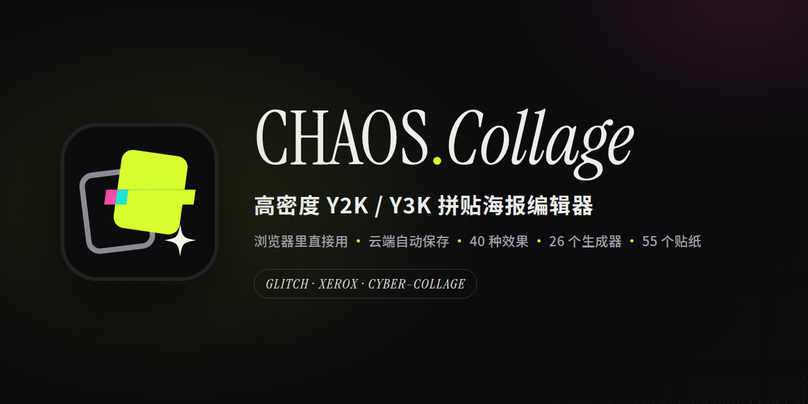
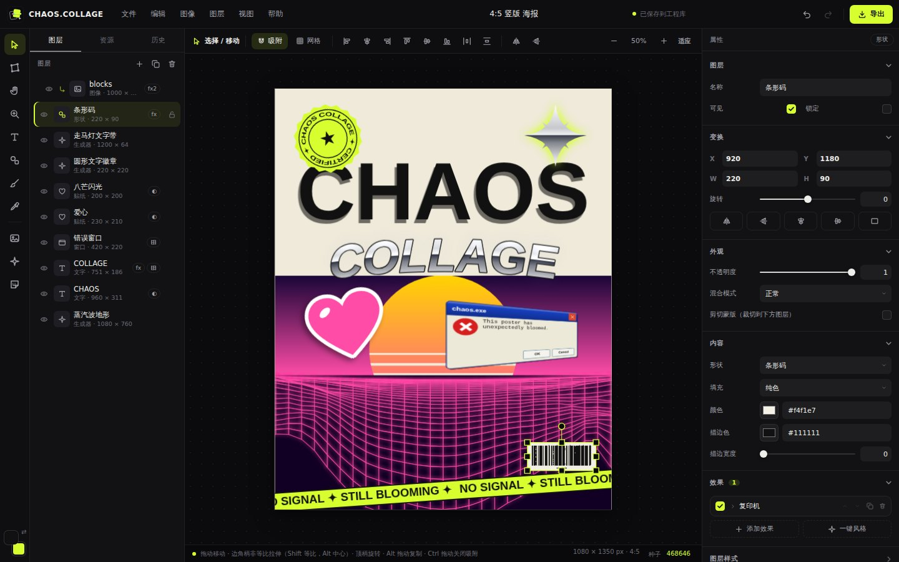

<p align="center"></p>

<p align="center"><a href="README.md">中文</a> · <b>English</b></p>

# CHAOS.COLLAGE

A browser editor for dense Y2K / Y3K / cyber-collage / Xerox-style static graphics. Use it locally with no install, build step or network, or deploy it to your own server as a cloud service with accounts and cloud autosave.



## Run

On Windows, double-click **CHAOS.COLLAGE** on the desktop, or run `launch.bat` in this folder. That opens the editor in a Chrome/Edge app window.

You can also open `index.html` directly in Chrome or Edge. If the browser restricts local files, start a plain static server:

```bash
python -m http.server 8080
```

Then open `http://127.0.0.1:8080`. On macOS/Linux, `./serve.sh` runs the same command.

> Projects are stored in the browser profile (IndexedDB). Opening `index.html` directly (`file://`) and through the local server (`http://127.0.0.1:8080`) are different origins with separate project libraries. Use **文件 → 另存为工程文件** to back up or move projects as `.chaos` files.

## Cloud deployment

On a Linux server with Docker and a domain pointing at it:

```bash
git clone https://github.com/LioraRndr/ChaosCollege.git && cd ChaosCollege
cp .env.example .env        # set CC_DOMAIN
docker compose up -d --build
```

Caddy obtains HTTPS certificates automatically. Anyone can register (configurable: invite code, user cap, per-account quota); projects, images, thumbnails and imported fonts autosave to the account, and **File → Save project file** still downloads a local `.chaos` copy. The server is `server/chaos_server.py`, Python standard library only (HTTP + SQLite + files). Full guide (Chinese): [docs/DEPLOY.md](docs/DEPLOY.md).

## Projects

- Project home screen: quick presets, recent projects with thumbnails, search / sort, open, rename, duplicate, export `.chaos`, delete, storage usage.
- New project dialog: common ratios, social platforms, print at 300 DPI, screens, legacy sizes, or custom size in px / mm / cm / in with DPI.
- Autosave to the local project library (the home screen footer shows which browser / origin holds it); **Ctrl+S** saves immediately (and writes the linked `.chaos` file if one is open), **Ctrl+Shift+S** saves a `.chaos` file with embedded images and imported fonts, **Ctrl+O** opens one. Once a project is linked to a `.chaos` file, autosave also refreshes that file while write permission is granted (after a browser restart, press Ctrl+S once to grant it again).
- If projects vanish after a restart, check that you opened the app the same way (desktop shortcut vs. a different browser or `http://`), and that the browser is not set to clear site data on exit.
- Canvas size changes live under **图像 → 画布大小… / 画布预设** and are applied once, with scale / stretch / anchor modes.

## Editing

- Tool rail: select, transform (distort / perspective / skew / mesh warp), hand, zoom, text, shape, brush, eyedropper, image import, generators, stickers; foreground / spare colors.
- Every layer type (image, text, shape, sticker, generator, brush stroke, window, 3D shatter) supports non-uniform stretch with 8 handles, rotation, flip, perspective / mesh warp, effects, layer styles (shadow, outer glow, sticker outline, frosted backdrop blur), clipping masks, blend modes and the repeater.
- Clicking where a selected layer lies keeps editing it even if other layers cover it (select a lower layer in the layers panel, then drag it on the canvas); right-click → **选择图层** lists every layer under the cursor.
- Viewport zoom / pan, smart snapping guides, marquee and multi-select, align / distribute, lock / hide, rename, drag reorder, copy / paste, paste images from the clipboard, drag & drop images / fonts / project files, undo history panel.
- Text: 160+ curated system fonts with availability detection, "read all local fonts" (Chrome / Edge), imported TTF / OTF / WOFF fonts saved to a local font library; weight, italic, tracking, line height, vertical text, arc bend, gradient / chrome / holo fills, double outline, stretch, quick style presets, on-canvas editing.

## Effects, generators, stickers

- 40 stackable effects in six groups (color, print / pixel, glitch, distort, light / material, stylize), including the approved **Datamosh Frame** stuck-frame look (pixel-identical to the 2026-09-30 algorithm on opaque images) and **Block glitch**.
- 18 one-click looks (Y3K, glitch, print, light).
- 26 parametric generators (UI parts, codes, patterns, 3D wireframes, vaporwave terrain, type bands / badges, Y3K grain gradients, liquid metal, cybersigils, HUD) plus error windows, barcode, tape, confetti and 3D shatter.
- 55 recolorable vector stickers (Y2K symbols, UI / computer, pixel art).
- Export PNG / JPG / WEBP at 0.5×–4×, optional transparency, whole canvas or selected layers only.

## Useful shortcuts

- Tools: `V` `W` `H` `Z` `T` `U` `B` `I`, `G` generators, `E` stickers, hold `Space` to pan
- `Ctrl/Cmd + Z` / `Ctrl/Cmd + Shift + Z`: undo / redo
- `Ctrl/Cmd + C / X / V`, `Ctrl/Cmd + D` duplicate, `Delete` remove, `Ctrl/Cmd + A` select all
- `Ctrl/Cmd + 0` fit, `Ctrl/Cmd + 1` 100%, `Ctrl/Cmd + wheel` zoom
- `Ctrl/Cmd + S` save, `Ctrl/Cmd + Shift + S` save project file, `Ctrl/Cmd + E` export
- Full list: **帮助 → 快捷键**

## License

[MIT](LICENSE) © 2026 LioraRndr

## Project documentation

Start with [`docs/README.md`](docs/README.md) for the project map, current handoff, research notes and local session history. Agent-specific working rules live in [`AGENTS.md`](AGENTS.md).
