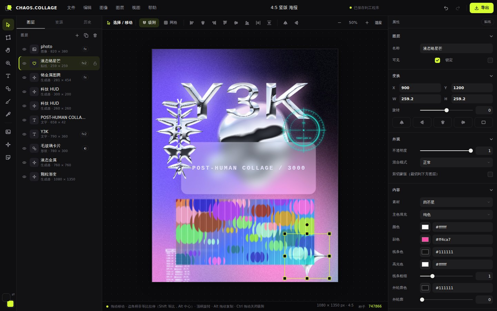
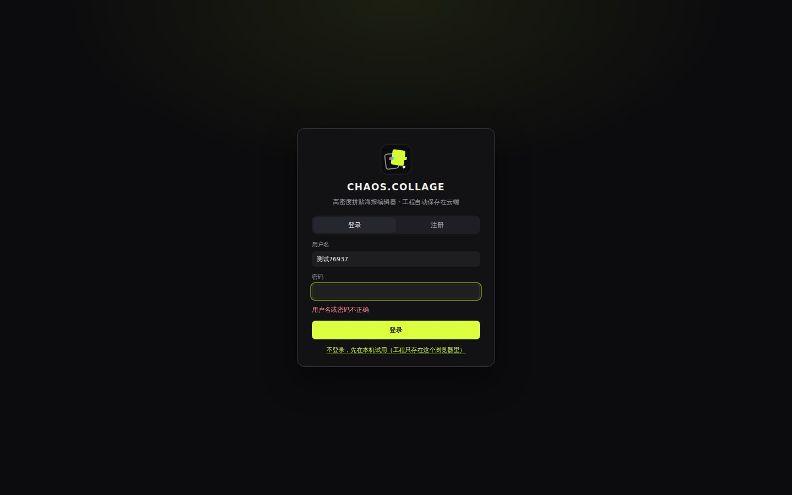

<p align="center">
  
</p>

<p align="center">
  <a href="LICENSE"></a>
  
  
  
</p>

<p align="center"><b>中文</b> · <a href="README.en.md">English</a></p>

**CHAOS.COLLAGE** 是一个在浏览器里运行的平面设计编辑器，专门用来做高密度的 Y2K / Y3K、赛博拼贴、复印机 / Punk 风格海报和静态故障图。不用安装，打开就能用；也可以部署到自己的服务器上，提供注册登录、工程自动保存到云端的在线服务。


## 特色

- **拼贴优先的编辑器**：图片、文字、形状、矢量贴纸、生成器、笔刷、错误窗口、3D 爆裂碎片，全部图层都能非等比拉伸、旋转、翻转、透视 / 网格变形，叠加效果与图层样式。
- **40 种可叠加效果**：调色、印刷 / 像素、故障、扭曲、光效 / 材质、风格化六组，包括区块故障（Block glitch）与帧感染（Datamosh Frame）这类静态故障效果；另有 18 个一键风格。
- **26 个参数化生成器**：UI 部件、条码、图案、3D 线框、蒸汽波地形、文字带 / 徽章、Y3K 颗粒渐变、液态金属、赛博图腾、HUD 等。
- **55 个可换色矢量贴纸**：Y2K 符号、UI / 电脑、像素图标。
- **文字排版**：160 多个分组字体（自动检测本机可用）、读取本机全部字体、导入 TTF / OTF / WOFF；弧形、竖排、渐变 / 镀铬 / 全息填充、双层描边。
- **工程管理**：工程主页、常用尺寸预设（社交平台 / 印刷 300 DPI / 屏幕）、自动保存、撤销历史，`.chaos` 工程文件可另存到本地再打开。
- **两种用法**：
  - **本机版**：直接打开 `index.html`，工程存在浏览器里，完全离线。
  - **云端版**：部署到服务器后开放注册，工程、图片、字体自动保存到账号下，换设备登录即可继续编辑。



## 快速开始

### 本机直接用

- **Windows**：双击 `launch.bat`（或桌面快捷方式），会用 Chrome / Edge 的应用窗口打开编辑器。
- **其他系统**：用 Chrome 或 Edge 打开 `index.html`。

本机版的工程保存在当前浏览器里。换浏览器、换打开方式（直接打开 / 本地服务器）会看到另一个独立的工程库；重要工程请用「文件 → 另存为工程文件」保存 `.chaos` 备份。

### 部署云端版

需要一台装了 Docker 的 Linux 服务器和一个解析到它的域名：

```bash
git clone https://github.com/LioraRndr/ChaosCollege.git
cd ChaosCollege
cp .env.example .env        # 把 CC_DOMAIN 改成你的域名
docker compose up -d --build
```

几十秒后打开 `https://你的域名` 即可注册使用，HTTPS 证书由 Caddy 自动申请和续期。完整步骤、配置项、备份与账号管理见 **[部署文档](docs/DEPLOY.md)**。

<p align="center"></p>

也可以不用 Docker，直接用 Python 3.9+ 运行（只用标准库，无需 `pip install`）：

```bash
python3 server/chaos_server.py --host 0.0.0.0 --port 8080
```

## 云端版是怎么保存的

- 每次改动约 1 秒后自动保存到服务器；断网时保留改动并自动重试，关闭页面前会提示未保存的改动。
- 图片按内容去重存储，工程本身只是一小段 JSON，所以保存很快。
- 同一工程在两个窗口或设备上同时修改时，后保存的一方会收到提示，选择「加载云端版本」或「用当前窗口覆盖」。
- 「文件 → 另存为工程文件」随时把工程（含图片和用到的导入字体）下载为 `.chaos` 文件；「导出」输出 PNG / JPG / WEBP。
- 账号只需要用户名和密码（scrypt 加盐哈希），不收集邮箱；每个账号有空间配额，管理员可在服务器上重置密码、停用或删除账号。

## 常用快捷键

| 操作 | 快捷键 |
|---|---|
| 工具：选择 / 变形 / 抓手 / 缩放 / 文字 / 形状 / 笔刷 / 吸管 | `V` `W` `H` `Z` `T` `U` `B` `I` |
| 生成器 / 贴纸 | `G` / `E` |
| 撤销 / 重做 | `Ctrl+Z` / `Ctrl+Shift+Z` |
| 复制 / 剪切 / 粘贴 / 复制图层 | `Ctrl+C` / `Ctrl+X` / `Ctrl+V` / `Ctrl+D` |
| 保存 / 另存为工程文件 / 打开 | `Ctrl+S` / `Ctrl+Shift+S` / `Ctrl+O` |
| 导出 / 快速导出 PNG | `Ctrl+E` / `Ctrl+Shift+E` |
| 适应窗口 / 100% | `Ctrl+0` / `Ctrl+1` |
| 平移画布 | 按住 `空格` 拖动 |

完整列表见编辑器里的「帮助 → 快捷键」。

## 项目结构

```text
index.html  styles.css  app.js   编辑器（纯 HTML / CSS / JS，无构建步骤）
js/                              编辑器模块：渲染、效果、生成器、文字、云端存储等
server/chaos_server.py           云端服务（Python 标准库：HTTP + SQLite + 文件存储）
Dockerfile  docker-compose.yml   容器部署（含 Caddy 自动 HTTPS）
deploy/                          Caddy 配置、无域名的 HTTP 试用配置
assets/                          Logo、图标
docs/                            部署文档、项目上下文、调研与验证记录
```

架构与开发约定见 [docs/PROJECT_CONTEXT.md](docs/PROJECT_CONTEXT.md)。

## 参与贡献

欢迎提 Issue 和 Pull Request，参见 [贡献指南](CONTRIBUTING.md)。发现安全问题请按 [安全说明](SECURITY.md) 私下报告。

## 许可证

[MIT](LICENSE) © 2026 LioraRndr
